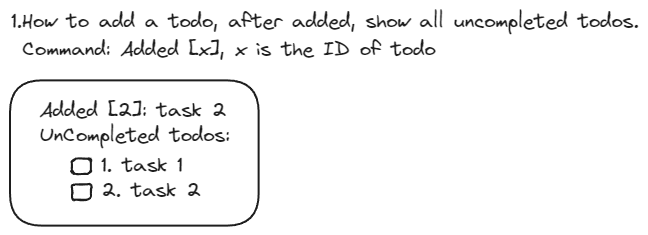

### 需要的功能（粗）
- 添加一个todo
- 完成一个todo
- 搁置一个todo
- todo的状态变更
  - 未完成
  - 已完成
  - 不做
  - 搁置
- 把一个todo放入回收站
  - 恢复回收产todo
  - 清空回收站
- 清空所有todo
- 列出所有未完成的todo
- 列出所有已完成的todo
- 列出所有回收站的todo
- 列出所有todo
- 对已有todo进行修改

### 详细功能
- 添加一个todo
  - 创建时记录时间
  - 每个todo都有唯一标识
  - todo的文本可以包含常见的特殊字符，如, #, $等
    - 标签功能（待定）
  - todo的文本可以多行
    - 需要限定最大字符数
- 完成一个todo
  - 完成时记录时间
  - 通过标记标识完成状态
- 搁置一个todo
  - 搁置时记录时间
  - reopen todo
  - 通过标记标识搁置状态
  - 恢复一个被搁置的todo
- 删除一个todo并置入回收站
  - 删除一个未完成任务
  - 删除一个已完成任务
  - 删除一个搁置任务
  - 从回收站恢复任务
- 彻底删除一个todo（从回收站）

### 功能对应界面

