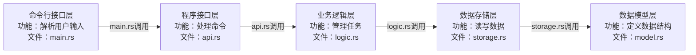
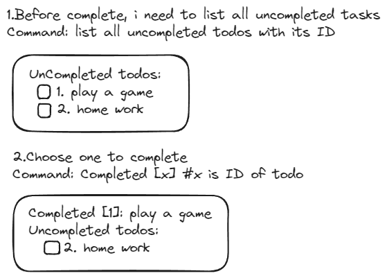
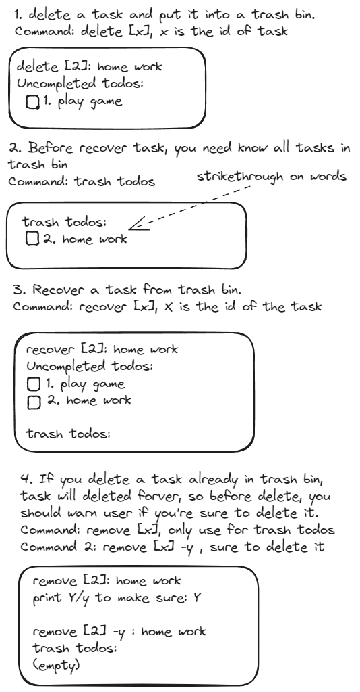
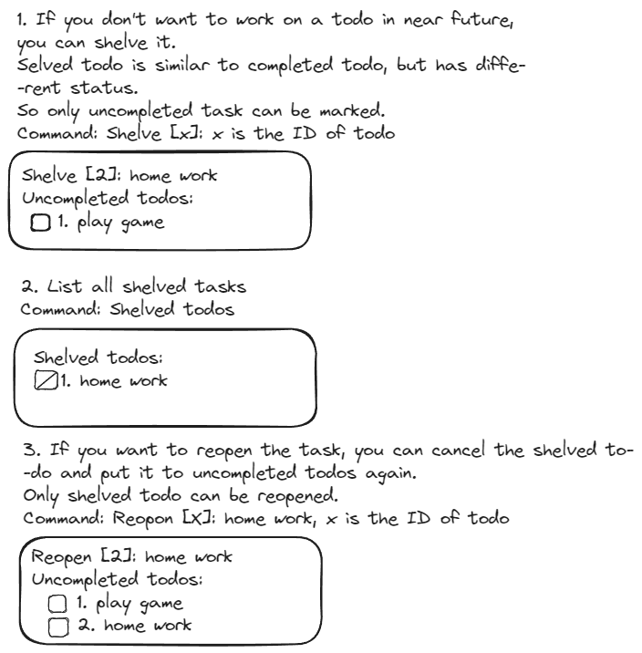
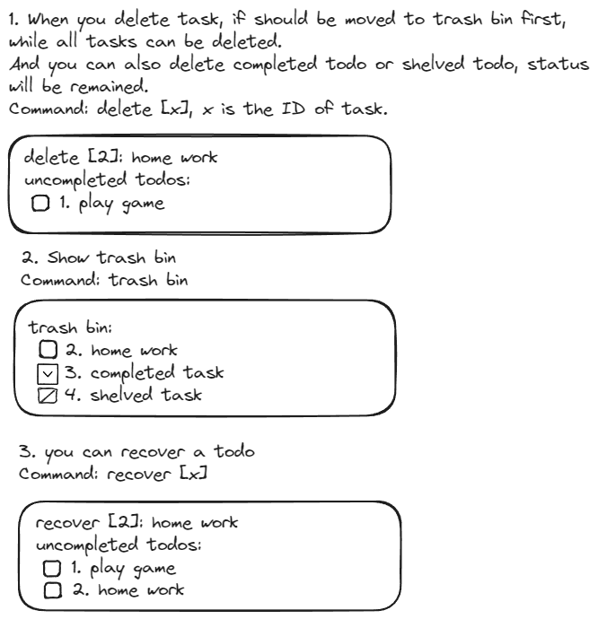

### 需要的功能（粗）
- 添加一个todo
- 完成一个todo
- 搁置一个todo
- todo的状态变更
  - 未完成
  - 已完成
  - 不做
  - 搁置
- 把一个todo放入回收站
  - 恢复回收产todo
  - 清空回收站
- 清空所有todo
- 列出所有未完成的todo
- 列出所有已完成的todo
- 列出所有回收站的todo
- 列出所有todo
- 对已有todo进行修改

### 详细功能
- 添加一个todo
  - 创建时记录时间
  - 每个todo都有唯一标识
  - todo的文本可以包含常见的特殊字符，如, #, $等
    - 标签功能（待定）
  - todo的文本可以多行
    - 需要限定最大字符数
- 完成一个todo
  - 完成时记录时间
  - 通过标记标识完成状态
- 搁置一个todo
  - 搁置时记录时间
  - reopen todo
  - 通过标记标识搁置状态
  - 恢复一个被搁置的todo
- 删除一个todo并置入回收站
  - 删除一个未完成任务
  - 删除一个已完成任务
  - 删除一个搁置任务
  - 从回收站恢复任务
- 彻底删除一个todo（从回收站）
  - 删除前需要复核是否删除

### 交互设计
#### 用户输入

- 添加一个todo

```bash
add <todo-name>
fail: <why>
```

- 完成一个todo

```bash
complete <todo-id>
fail: <why>
```

- 删除一个todo

```bash
delete <todo-id>
fail: <why>
```

- 搁置一个todo

```bash
shelve <todo-id>
fail: <why>
```

- 完全删除一个todo

```bash
remove <todo-id>
fail: <why>
```

### 架构设计
- 应用应该包含哪些行为？
  - 与用户交互
    - 命令行参数解析
    - 正确和错误的结果输出
  - 实现用户的指令
    - 添加一个todo
    - 完成一个todo
    - 删除一个todo
    - 搁置一个todo
    - 完全删除一个todo
  - 与数据交互
    - 数据模型定义
    - 数据的持久化
      - json文件？
    - 怎么读取写入？
      - 文件读写
      - 模型映射（序列化与反序列化）
        - 对象可以变成json
        - json可以变成对象
- 基于上述行为，应用应该包含哪些模块？
  - 命令行接口层
  - 程序接口层（封装所有程序行为，除了与用户交互的部分）
  - 业务逻辑层（封装各种功能）
  - 数据存储层（封装数据的读写）
  - 数据模型层（封装数据的结构）
- 模块间的关系？谁依赖谁？


### 接口设计
#### 命令行接口层
提供对用户的操作指令，调用下层接口</br>
帮助文档
```bash
rtd -h
rtd --help
```
添加一个todo
```bash
rtd -a <item-name>
rtd --add <item-name>
```
列出所有未完成的todo
```bash
rtd -l
rtd --list
rtd -l uncompleted
rtd --list uncompleted
```
完成一个todo
```bash
rtd -c <item-id>
rtd --complete <item-id>
```
列出所有完成的todo
```bash
rtd -l completed
rtd --list completed
```
标记一个todo为未完成
```bash
rtd -u <item-id>
rtd --uncomplete <item-id>
```
搁置一个todo
```bash
rtd -s <item-id>
rtd --shelve <item-id>
```
列出所有搁置的todo
```bash
rtd -l shelved
rtd --list shelved
```
删除一个todo
```bash
rtd -d <item-id>
rtd --delete <item-id>
```
列出所有已删除的todo
```bash
rtd -l deleted
rtd --list deleted
```
物理删除一个todo
```bash
rtd --destory <item-id>
```
把一个todo从回收站恢复
```bash
rtd -r <item-id>
rtd --restore <item-id>
```
清空回收站
```bash
rtd --destory-all
```
列出所有todo
```bash
rtd -l all
rtd --list all
```

#### 程序接口层
把所有程序逻辑统一集中到这里，统一对外提供

#### 业务逻辑层
使用以下形式定义接口
```rust
function_name(input) -> output
```
添加一个todo
```rust
add_item(item_name) -> result_message
```
列出所有未完成的todo
```rust
list_uncompleted_items() -> result_message
```
完成一个todo
```rust
complete_item(item_id) -> result_message
```
列出所有完成的todo
```rust
list_completed_items() -> result_message
```
标记一个todo为未完成
```rust
uncomplete_item(item_id) -> result_message
```
搁置一个todo
```rust
shelve_item(item_id) -> result_message
```
列出所有搁置的todo
```rust
list_shelved_items() -> result_message
```
删除一个todo
```rust
delete_item(item_id) -> result_message
```
列出所有已删除的todo
```rust
list_deleted_items() -> result_message
```
物理删除一个todo
```rust
destory_item(item_id) -> result_message
```
把一个todo从回收站恢复
```rust
restore_item(item_id) -> result_message
```
清空回收站
```rust
destory_all_items() -> result_message
```
列出所有todo
```rust
list_all_items() -> result_message
```

#### 数据存储层
定义一个todo的属性和行为
```rust
item {
  id: u32,
  name: String,
  status: ItemStatus,
  create_time: DateTime,
  complete_time: DateTime,
  shelve_time: DateTime,
  delete_time: DateTime,

  new(id, name,status, create_time, complete_time, shelve_time, delete_time),
  beautify(), // 格式化显示信息
  to_string(), // 转换成字符串
  from_string(), // 从字符串转换
  to_json(), // 转换成json
  from_json(), // 从json转换
}
```


### 功能对应界面






