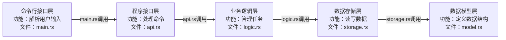

### 需要的功能（粗）
- 添加一个todo
- 完成一个todo
- 搁置一个todo
- todo的状态变更
  - 未完成
  - 已完成
  - 不做
  - 搁置
- 把一个todo放入回收站
  - 恢复回收产todo
  - 清空回收站
- 清空所有todo
- 列出所有未完成的todo
- 列出所有已完成的todo
- 列出所有回收站的todo
- 列出所有todo
- 对已有todo进行修改

### 详细功能
- 添加一个todo
  - 创建时记录时间
  - 每个todo都有唯一标识
  - todo的文本可以包含常见的特殊字符，如, #, $等
    - 标签功能（待定）
  - todo的文本可以多行
    - 需要限定最大字符数
- 完成一个todo
  - 完成时记录时间
  - 通过标记标识完成状态
- 搁置一个todo
  - 搁置时记录时间
  - reopen todo
  - 通过标记标识搁置状态
  - 恢复一个被搁置的todo
- 删除一个todo并置入回收站
  - 删除一个未完成任务
  - 删除一个已完成任务
  - 删除一个搁置任务
  - 从回收站恢复任务
- 彻底删除一个todo（从回收站）
  - 删除前需要复核是否删除

### 交互设计
#### 用户输入

- 添加一个todo

```bash
add <todo-name>
fail: <why>
```

- 完成一个todo

```bash
complete <todo-id>
fail: <why>
```

- 删除一个todo

```bash
delete <todo-id>
fail: <why>
```

- 搁置一个todo

```bash
shelve <todo-id>
fail: <why>
```

- 完全删除一个todo

```bash
remove <todo-id>
fail: <why>
```

### 架构设计
- 应用应该包含哪些行为？
  - 与用户交互
    - 命令行参数解析
    - 正确和错误的结果输出
  - 实现用户的指令
    - 添加一个todo
    - 完成一个todo
    - 删除一个todo
    - 搁置一个todo
    - 完全删除一个todo
  - 与数据交互
    - 数据模型定义
    - 数据的持久化
      - json文件？
    - 怎么读取写入？
      - 文件读写
      - 模型映射（序列化与反序列化）
        - 对象可以变成json
        - json可以变成对象
- 基于上述行为，应用应该包含哪些模块？
  - 命令行接口层
  - 程序接口层（封装所有程序行为，除了与用户交互的部分）
  - 业务逻辑层（封装各种功能）
  - 数据存储层（封装数据的读写）
  - 数据模型层（封装数据的结构）
- 模块间的关系？谁依赖谁？



### 功能对应界面


